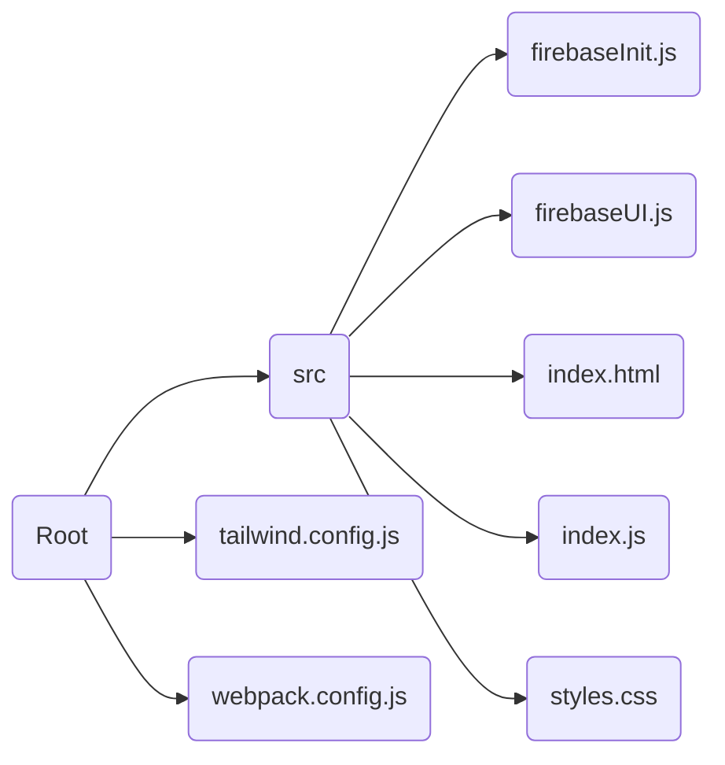

### Create Webpack App
https://createapp.dev/
#### Checklist
- **Main Library**
  - No library
- **UI library**
  - Tailwind CSS
- **Transpiler**
  - Babel
- **Styling**
  - CSS
	- PostCSS
- **Linting**
	- ESLint
- **Webpack plugins**
	- HTML webpack plugin
	- MiniCSSExtractPlugin

```bash
npm install
```

> Files that should be the focus


> Webpack Devserver
```js
  /*Others config*/
  devServer: {
    static: {
      directory: path.join(__dirname, "dist"),
    },
    compress: true,
    port: 9000,
  },
  /*others config*/
```

### TailwindCSS Setup
```js
/** @type {import('tailwindcss').Config} */
module.exports = {
  content: ['./dist/**/*.html', './dist/**/*.js'],
  // purge is important for purging old files
  purge: ["./src/**/*.html", "./src/**/*.{js, jsx, ts, tsx}"],
  theme: {
    extend: {},
  },
  plugins: [],
}
```

### Firebase Setup 
https://firebase.google.com/docs/web/setup

```bash
npm install firebase
```

>firebaseInit.js
```js
import firebase from 'firebase/compat/app'

const firebaseConfig = {/*...*/}

// Initialize Firebase
firebase.initializeApp(firebaseConfig)
```
>[info]
>The config of firebase can be found in Firebase console -> Settings -> Project Settings -> General

#### FirebaseUI Setup
https://firebase.google.com/docs/auth/web/firebaseui
https://github.com/firebase/firebaseui-web
```js
import firebase from 'firebase/compat/app'
import * as firebaseui from 'firebaseui'

// FirebaseUI config.
var uiConfig = {
  signInSuccessUrl: '/',
  signInFlow: 'popup',
  signInOptions: [
    firebase.auth.GoogleAuthProvider.PROVIDER_ID
  ],
  // tosUrl and privacyPolicyUrl accept either url string or a callback
  // function.
  // Terms of service url/callback.
  tosUrl: '<your-tos-url>',
  // Privacy policy url/callback.
  privacyPolicyUrl: function () {
    window.location.assign('<your-privacy-policy-url>')
  }
}

// Initialize the FirebaseUI Widget using Firebase.
var ui = new firebaseui.auth.AuthUI(firebase.auth())
// The start method will wait until the DOM is loaded.
ui.start('#firebaseui-auth-container', uiConfig)
```
##### Adding auth element
```js
//....Code above....

// Initialize the FirebaseUI Widget using Firebase.
var ui = new firebaseui.auth.AuthUI(firebase.auth())
// The start method will wait until the DOM is loaded.
export default function startUi() {
  const App = document.querySelector('#app')

  App.insertAdjacentHTML(
    'beforeend', /*html*/ `
    <div id="firebaseui-auth-container" class="mt-60"></div>
    `
  )

  ui.start('#firebaseui-auth-container', uiConfig)
}
```

#### index.js
```js
import './styles.css'
import 'firebaseui/dist/firebaseui.css'
import './firebaseInit'
import startUi from './firebaseUI'
import { getAuth, onAuthStateChanged } from 'firebase/auth'

const auth = getAuth()

onAuthStateChanged(auth, (user) => {
  if (user) {
    // User is signed in
    console.log('logged in')
    console.log(user)
  } else {
    // User is signed out
    console.log('logged out')
  }
})
```
>Playing with the UI & show user profile
```js
import './styles.css'
import 'firebaseui/dist/firebaseui.css'
import './firebaseInit'
import startUi from './firebaseUI'
import { getAuth, onAuthStateChanged } from 'firebase/auth'

const auth = getAuth()

clearScreen()

onAuthStateChanged(auth, (user) => {
  if (user) {
    // User is signed in
    clearScreen()
    showProfile(user)
  } else {
    // User is signed out
    clearScreen()
    startUi() 
  }
})

function clearScreen() {
  document.querySelector('#app').innerHTML = ''
}

function showProfile(user) {
  const App = document.querySelector('#app')

  App.insertAdjacentHTML('beforeend', /*html*/`
      <div class="mt-60 flex items-center justify-center flex-col">
        
        <h1 class='font-semibold'>${user.displayName}</h1>
        <p class='mb-6'>${user.email}</p>
        <button id="logout" class='rounded-full bg-rose-500 text-white py-2 px-6 font-normal tracking-wide hover:opacity-50 transition-opacity'>LOGOUT</button>
      </div>
    `
  )

  document.querySelector('#logout').addEventListener('click', () => {
    clearScreen()
    auth.signOut()
  })
}
```
